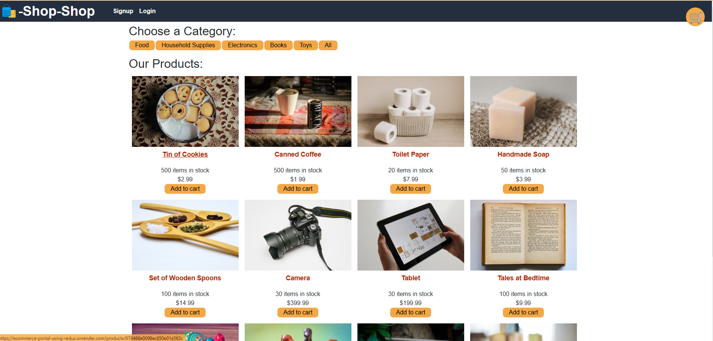
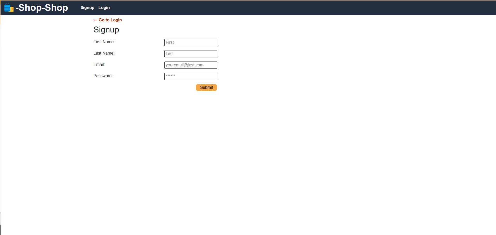
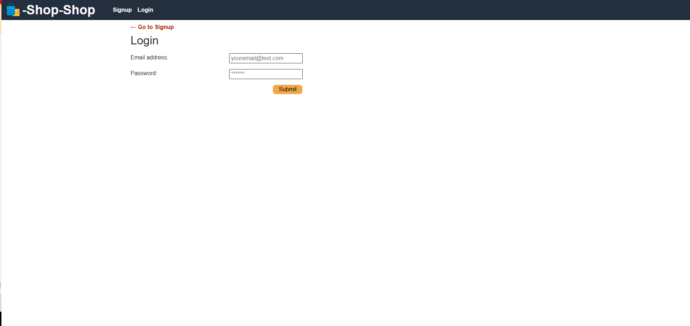
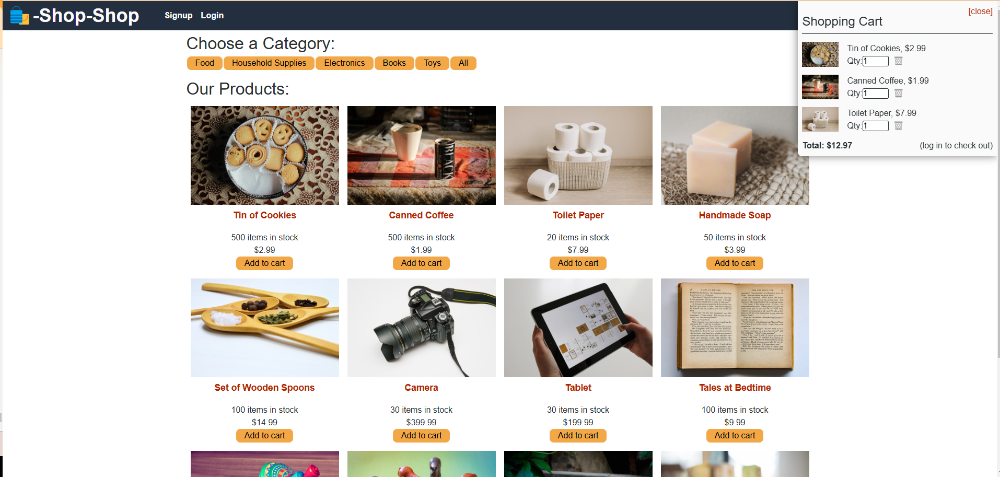

# E-commerce Platform with Redux 🛍️

A modern e-commerce platform built with MERN stack (MongoDB, Express.js, React, Node.js) and Redux for state management. This application provides a robust shopping experience with features like product browsing, cart management, and secure checkout.

## 🔗 Live Application
[Visit the deployed application](https://ecommerce-portal-using-redux.onrender.com/)

## Table of Contents
- [Live Application](#-live-application)
- [Features](#features)
- [Technologies Used](#technologies-used)
- [Project Structure](#project-structure)
- [Getting Started](#getting-started)
- [Redux Implementation](#redux-implementation)
- [Deployment](#deployment)
- [Screenshots](#screenshots)
- [Contributing](#contributing)
- [License](#license)

## Features

| Feature | Description |
|---------|------------|
| Product Catalog | Browse products with category filtering |
| Shopping Cart | Add/remove items, update quantities |
| User Authentication | Secure signup/login functionality |
| Order History | View past orders and details |
| Category Management | Filter products by categories |
| Responsive Design | Mobile-friendly interface |
| Secure Checkout | Integration with Stripe payments |
| State Management | Centralized Redux store |

## Technologies Used

### Frontend
- React
- Redux Toolkit
- Apollo Client
- Vite
- React Router DOM
- Stripe Integration

### Backend
- Node.js
- Express.js
- MongoDB
- GraphQL
- JWT Authentication
- bcryptjs

### Development & Deployment
- Git
- npm
- ESLint
- Render (Deployment)
- MongoDB Atlas

## Project Structure

```
client/
├── public/
│   └── images/
├── src/
│   ├── assets/
│   ├── components/
│   ├── pages/
│   ├── redux/
│   │   ├── features/
│   │   └── store.js
│   ├── utils/
│   └── App.jsx
server/
├── config/
├── models/
├── schemas/
└── server.js
```

## Getting Started

1. Clone the repository:
```bash
git clone https://github.com/yourusername/your-repo-name.git
cd your-repo-name
```

2. Install dependencies:
```bash
npm install
cd client && npm install
cd ../server && npm install
```

3. Set up environment variables:
```env
MONGODB_URI=your_mongodb_uri
JWT_SECRET=your_jwt_secret
STRIPE_KEY=your_stripe_key
```

4. Start development servers:
```bash
npm run develop
```

## Redux Implementation

The application uses Redux Toolkit for state management with the following slices:

### Cart Slice
- Manages shopping cart state
- Handles add/remove/update operations
- Syncs with IndexedDB

### Categories Slice
- Manages product categories
- Handles category filtering
- Updates current category

### Products Slice
- Manages product data
- Handles product updates
- Syncs with backend

## Deployment

### Prerequisites
- Render account
- MongoDB Atlas account
- Environmental variables configured

### Deployment Steps

1. Push code to GitHub repository

2. Create new Web Service in Render:
   - Connect repository
   - Set build command:
   ```bash
   npm install && cd client && npm install && npm run build && cd ..
   ```
   - Set start command:
   ```bash
   npm start
   ```

3. Configure environment variables in Render

4. Deploy and monitor build process

Current Deployment: [https://ecommerce-portal-using-redux.onrender.com](https://ecommerce-portal-using-redux.onrender.com)

## Screenshots







## Contributing

1. Fork the repository
2. Create a feature branch
```bash
git checkout -b feature/YourFeature
```
3. Commit changes
```bash
git commit -m 'Add some feature'
```
4. Push to the branch
```bash
git push origin feature/YourFeature
```
5. Create a Pull Request

## License

This project is licensed under the MIT License - see the [LICENSE](LICENSE) file for details.

## Acknowledgments

- Vite for build tooling
- Redux Toolkit for state management
- GraphQL for API queries
- MongoDB Atlas for database hosting
- Render for application hosting


